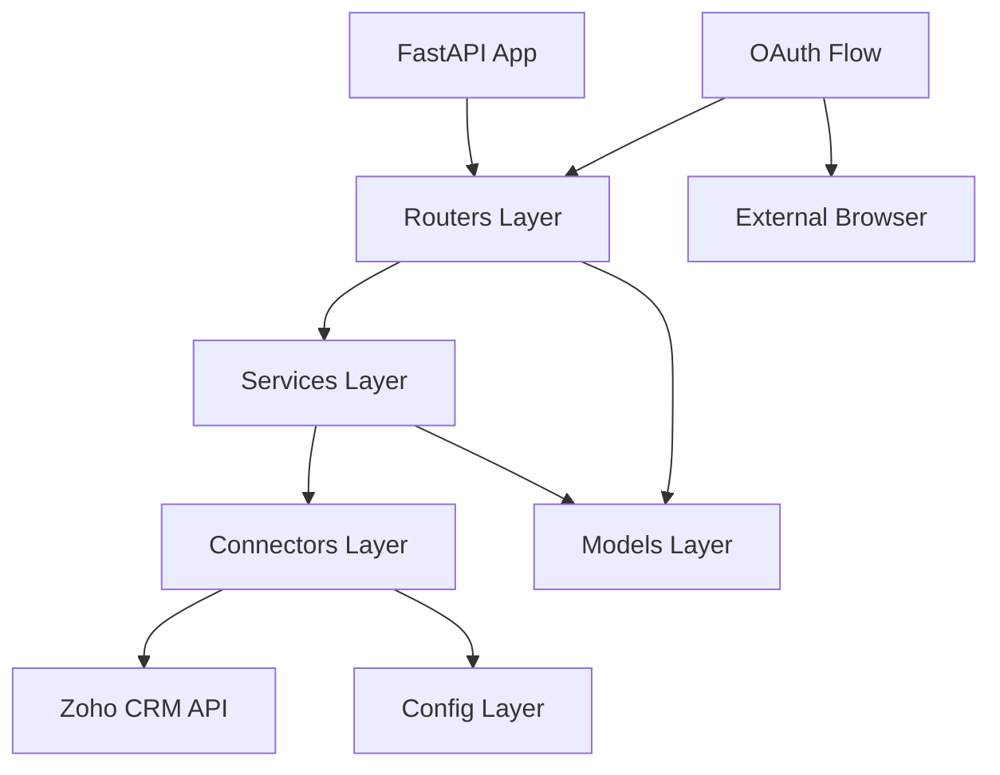
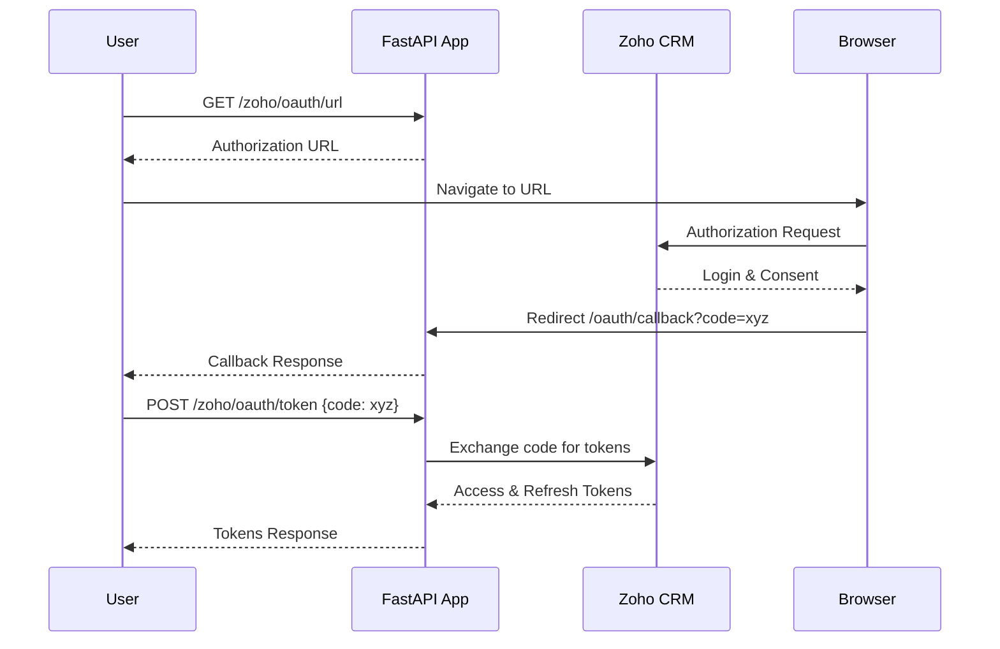
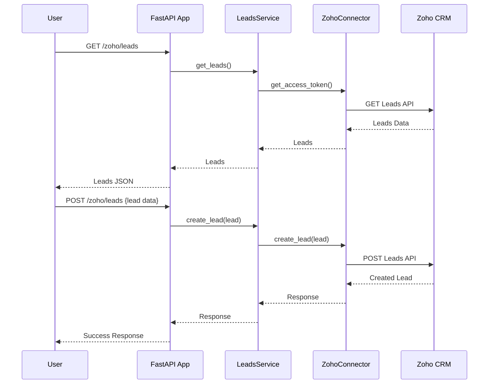

# Zoho CRM Lead API - Architecture and Flow

## Overview

This FastAPI application provides an integration with Zoho CRM for managing leads. It includes OAuth 2.0 authentication flow and CRUD operations for leads.

## Architecture

The application follows a layered architecture with clear separation of concerns:



### Layers Description

- **Routers Layer**: Handles HTTP requests and responses, defines API endpoints
- **Services Layer**: Business logic and data processing
- **Connectors Layer**: External API integrations and authentication
- **Models Layer**: Data models and validation using Pydantic
- **Config Layer**: Environment configuration and settings

## OAuth 2.0 Flow

The application implements Zoho's OAuth 2.0 authorization code flow:



## API Flow

Once authenticated, users can perform lead operations:



## File Structure

```
├── main.py                 # FastAPI application entry point
├── routers/
│   ├── leads.py           # Lead-related endpoints
│   └── oauth.py           # OAuth-related endpoints
├── services/
│   └── leads_service.py   # Lead business logic
├── connectors/
│   ├── zoho.py           # Zoho CRM API client
│   └── zoho_auth.py      # OAuth token management
├── models/
│   ├── lead.py           # Lead data model
│   └── oauth.py          # OAuth data models
├── core/
│   └── config.py         # Application configuration
├── requirements.txt       # Python dependencies
└── postman_collection.json # API testing collection
```

## Key Components

### Authentication
- Uses Zoho OAuth 2.0 with authorization code grant
- Stores refresh tokens for automatic token renewal
- Handles token expiration and refresh

### API Endpoints
- `GET /` - Health check
- `GET /oauth/callback` - OAuth callback handler
- `GET /zoho/oauth/url` - Get authorization URL
- `POST /zoho/oauth/token` - Exchange code for tokens
- `GET /zoho/leads` - Retrieve leads from Zoho CRM
- `POST /zoho/leads` - Create new lead in Zoho CRM

### Data Models
- **Lead**: first_name, last_name, email, phone (optional)
- **AuthCode**: code (for OAuth token exchange)

### Configuration
Environment variables required:
- `CLIENT_ID` - Zoho OAuth client ID
- `CLIENT_SECRET` - Zoho OAuth client secret
- `REFRESH_TOKEN` - Zoho refresh token
- `ZOHO_BASE_URL` - Zoho CRM API base URL
- `REDIRECT_URI` - OAuth redirect URI
- `OAUTH_AUTH_URL` - Zoho authorization URL
- `OAUTH_TOKEN_URL` - Zoho token exchange URL

## Error Handling

The application includes proper error handling:
- HTTP exceptions for API errors
- Validation errors for malformed requests
- External API error propagation
- Logging for debugging

## Security Considerations

- OAuth 2.0 for secure authentication
- Environment variables for sensitive data
- Input validation using Pydantic models
- HTTPS recommended for production
- Token refresh handling