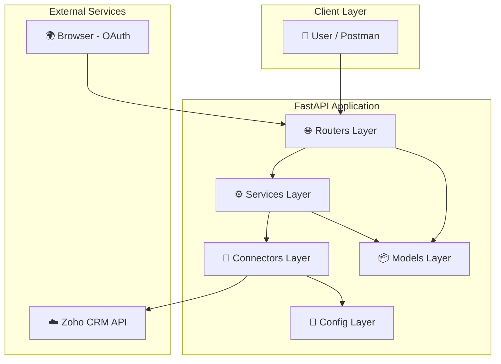
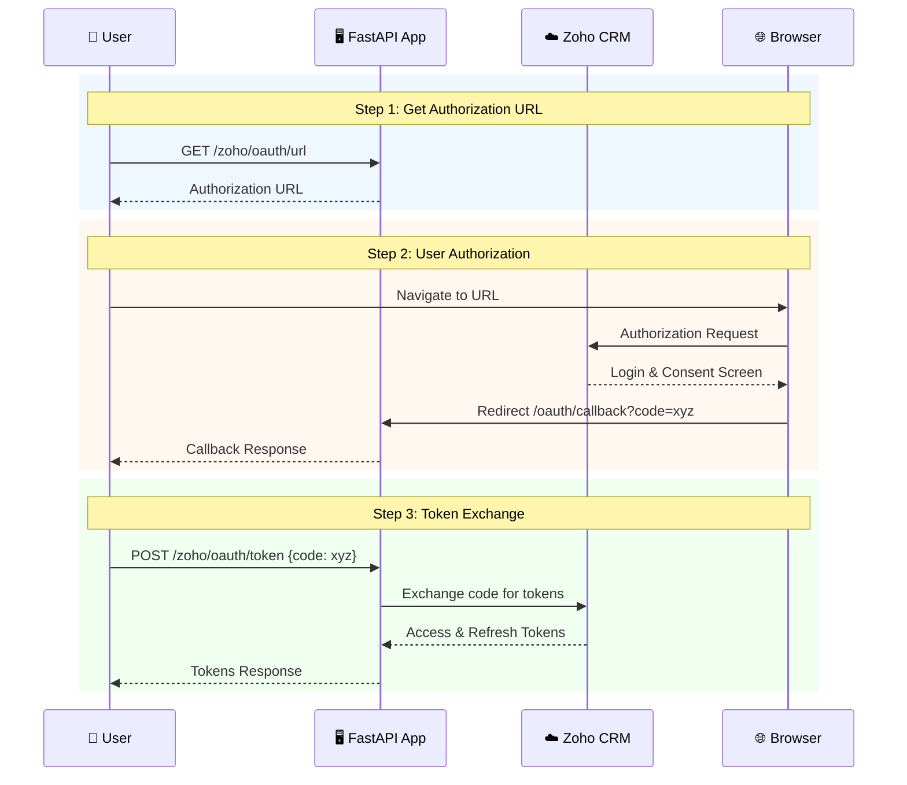
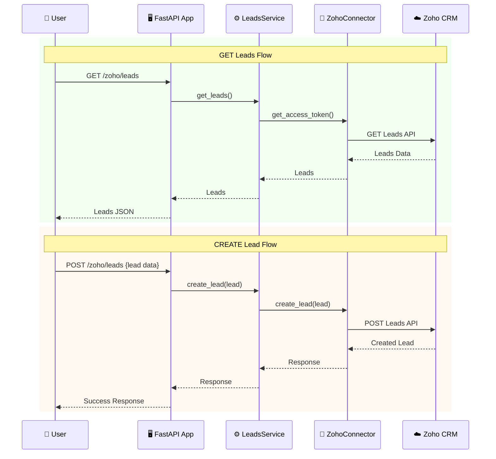
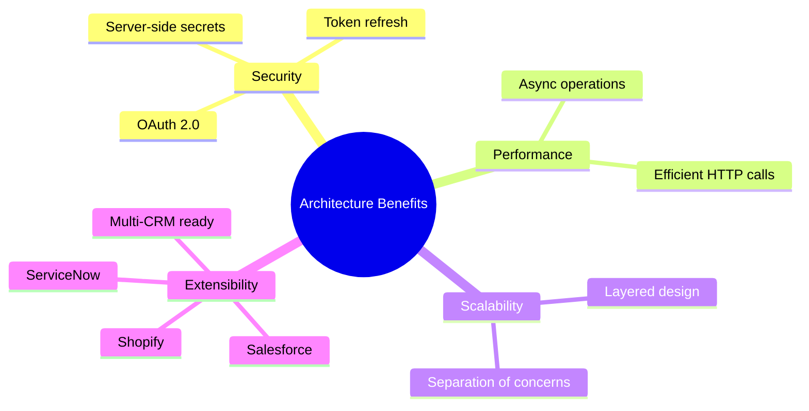
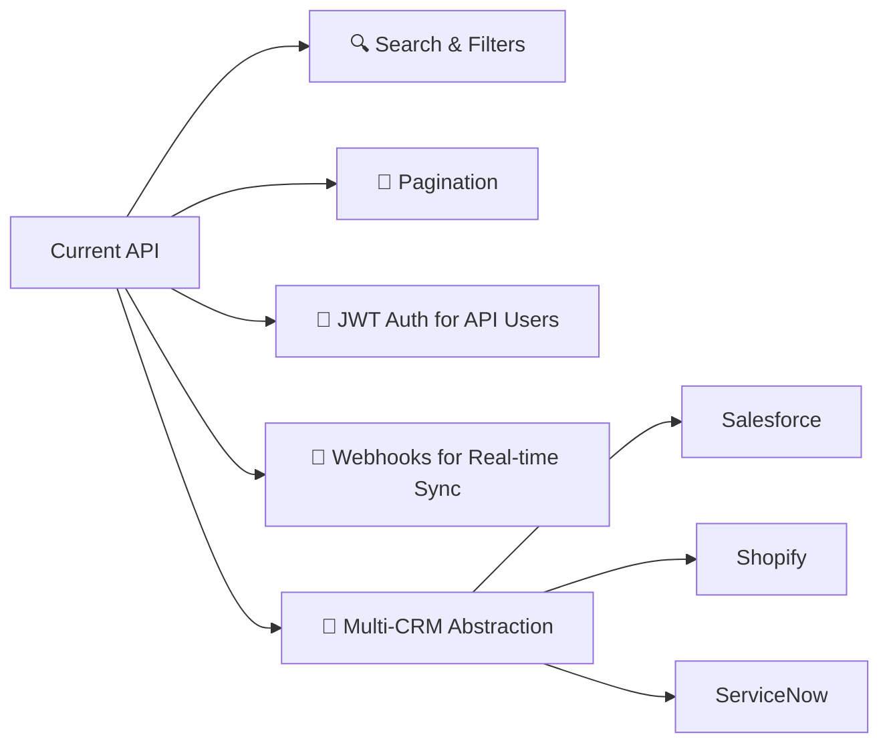

# Zoho CRM Integration with FastAPI — Complete Guide

This document explains **step‑by‑step** how we built a secure backend API layer in FastAPI to interact with **Zoho CRM Leads module** — including authentication, token handling, CRUD APIs, and best practices.

This is written so that:

✅ You understand what Zoho CRM is  
✅ You understand OAuth & token flow clearly  
✅ You can rebuild the integration anytime  
✅ You can extend it later to multiple CRMs

---

## 📐 Architecture Overview

The application follows a layered architecture with clear separation of concerns:



### Layers Description

| Layer | Purpose |
|-------|---------|
| **Routers Layer** | Handles HTTP requests and responses, defines API endpoints |
| **Services Layer** | Business logic and data processing |
| **Connectors Layer** | External API integrations and authentication |
| **Models Layer** | Data models and validation using Pydantic |
| **Config Layer** | Environment configuration and settings |

---

## 🏢 1. Understanding Zoho CRM (Simple Explanation)

Zoho CRM is a **cloud‑based Customer Relationship Management system**.

Companies use it to store and manage:

✔ Leads  
✔ Contacts  
✔ Accounts  
✔ Deals  
✔ Calls  
✔ Emails etc.

A **Lead** is someone who may become a customer.

**Example fields:**
- Name
- Email
- Company
- Phone
- Lead Source

Developers integrate with Zoho CRM to:

✔ push data into CRM  
✔ pull leads  
✔ update customer details  
✔ automate workflows

---

## 🌍 2. What is Zoho CRM API?

Zoho provides a **REST API** — meaning we communicate using HTTP requests.

For example:

```http
GET https://www.zohoapis.in/crm/v2/Leads
```

gives you a list of leads.

But — Zoho is secure.

So you **must authenticate first**.

And that's where **OAuth** comes in.

---

## 🔐 3. Zoho OAuth Authentication — VERY IMPORTANT

Zoho never allows you to simply call its API.

### OAuth 2.0 Flow Diagram



### Step‑1 — Create an OAuth Client in Zoho

Go to:

```url
https://api-console.zoho.in/
```

Create:

✔ Server‑based Client

Provide:
- Client Name
- Homepage URL
- Redirect URI →

```url
http://localhost:8000/oauth/callback
```

Zoho will give you:

🔑 CLIENT_ID  
🔑 CLIENT_SECRET

Save them in `.env`.

---

### Step‑2 — User Authorization (Generate Grant Token)

Open this URL in browser:

```url
https://accounts.zoho.in/oauth/v2/auth?
  scope=ZohoCRM.modules.ALL&
  client_id=YOUR_CLIENT_ID&
  response_type=code&
  access_type=offline&
  redirect_uri=http://localhost:8000/oauth/callback
```

You login → approve access → Zoho redirects:

```url
http://localhost:8000/oauth/callback?code=XXXX
```

This `code` = **Grant Token** (ONE‑TIME USE)

---

### Step‑3 — Exchange Grant Token → Refresh Token

FastAPI receives `code` and calls:

```http
POST https://accounts.zoho.in/oauth/v2/token
```

with

```text
grant_type=authorization_code
client_id=...
client_secret=...
redirect_uri=...
code=...
```

Zoho returns:

```text
refresh_token
access_token
```

### ⚠️ VERY IMPORTANT

✔ **Refresh Token = Long‑term**  
✔ **Access Token = valid ~1 hour**

We store only:

```text
CLIENT_ID
CLIENT_SECRET
REFRESH_TOKEN
```

Then we always generate new access tokens automatically.

---

## 🏗 4. Project Structure

```text
FastAPI-LeadsAPI
│
├── main.py                 # FastAPI application entry point
├── routers/
│   ├── leads.py           # Lead-related endpoints
│   └── oauth.py           # OAuth-related endpoints
├── services/
│   └── leads_service.py   # Lead business logic
├── connectors/
│   ├── zoho.py           # Zoho CRM API client
│   └── zoho_auth.py      # OAuth token management
├── models/
│   ├── lead.py           # Lead data model
│   └── oauth.py          # OAuth data models
├── core/
│   └── config.py         # Application configuration
├── requirements.txt       # Python dependencies
├── postman_collection.json # API testing collection
└── .env                   # Environment variables
```

---

## ⚙️ 5. Environment Variables

```bash
CLIENT_ID=xxxx
CLIENT_SECRET=xxxx
REFRESH_TOKEN=xxxx
ZOHO_BASE_URL=https://www.zohoapis.in/crm/v2
REDIRECT_URI=http://localhost:8000/oauth/callback
OAUTH_AUTH_URL=https://accounts.zoho.in/oauth/v2/auth
OAUTH_TOKEN_URL=https://accounts.zoho.in/oauth/v2/token
```

Loaded via:

```python
from dotenv import load_dotenv
```

---

## 🚀 6. FastAPI App Setup

Main entry file:

```python
from fastapi import FastAPI
from routers import leads

app = FastAPI(title="Zoho CRM Lead API")

app.include_router(leads.router)

@app.get("/")
async def root():
    return {"message": "Zoho CRM Lead API running"}
```

---

## 🔗 7. Token Handling Layer

We always create **fresh access tokens** when calling Zoho.

```python
async def get_access_token():
    POST https://accounts.zoho.in/oauth/v2/token
```

using refresh token.

This ensures:

✔ secure  
✔ automatic  
✔ reliable

---

## 🧠 8. Leads Connector — Talking to Zoho

This layer calls Zoho API directly.

### API Flow Diagram



### HTTP Methods

| Operation | Method | Endpoint |
|-----------|--------|----------|
| Fetch | `GET /Leads` |
| Create | `POST /Leads` |
| Update | `PUT /Leads/{id}` |
| Delete | `DELETE /Leads/{id}` |

All requests include header:

```http
Authorization: Zoho-oauthtoken <access_token>
```

---

## 🧩 9. Service Layer — Business Logic

We keep logic separate from routing.

Benefits:

✔ testable  
✔ reusable  
✔ scalable

---

## 🌐 10. API Routes

### Complete API Endpoint Reference

| Method | Endpoint | Description |
|--------|----------|-------------|
| `GET` | `/` | Health check |
| `GET` | `/oauth/callback` | OAuth callback handler |
| `GET` | `/zoho/oauth/url` | Get authorization URL |
| `POST` | `/zoho/oauth/token` | Exchange code for tokens |
| `GET` | `/zoho/leads` | Retrieve leads from Zoho CRM |
| `POST` | `/zoho/leads` | Create new lead in Zoho CRM |
| `PUT` | `/zoho/leads/{lead_id}` | Update existing lead |
| `DELETE` | `/zoho/leads/{lead_id}` | Delete a lead |
| `GET` | `/zoho/leads/summary` | Get clean lead summary |

### Lead Summary (Clean Output)

```http
GET /zoho/leads/summary
```

Returns:

```json
[
  {"id":"123","name":"John Doe","email":"john@x.com","company":"ABC"}
]
```

---

## 📦 11. Data Models

### Lead Model

```python
class Lead(BaseModel):
    first_name: str
    last_name: str
    email: Optional[str] = None
    phone: Optional[str] = None
```

### AuthCode Model

```python
class AuthCode(BaseModel):
    code: str  # For OAuth token exchange
```

---

## 🔥 12. Why This Architecture Is Strong



✔ Secure token management  
✔ Async performance  
✔ Separation of concerns  
✔ Ready for scale  
✔ Easy to extend to Salesforce / Shopify / ServiceNow

---

## 🛡 13. Security Notes

| ❌ Don't | ✔ Do |
|----------|------|
| Expose refresh token | Store secrets server‑side only |
| Send tokens to frontend | Restrict who can call your API |
| Log sensitive data | Use HTTPS in production |
| Hard-code credentials | Use environment variables |

---

## 🧪 14. Testing via Postman

### Create Lead

**POST**

```http
http://localhost:8000/zoho/leads
```

**Body:**

```json
{"first_name":"Malay","last_name":"Jain"}
```

### Update Lead

```http
PUT /zoho/leads/{id}
```

### Delete Lead

```http
DELETE /zoho/leads/{id}
```

---

## ⚠️ 15. Error Handling

The application includes proper error handling:

- HTTP exceptions for API errors
- Validation errors for malformed requests
- External API error propagation
- Logging for debugging

---

## 🎯 16. What You Now Have

✔ Full Zoho CRM integration layer  
✔ Production‑style backend  
✔ Token‑secure APIs  
✔ Clean data access

---

## 🚀 17. Next Possible Enhancements



🔹 Search & filters  
🔹 Pagination  
🔹 JWT auth for API users  
🔹 Webhooks for real‑time sync  
🔹 Multi‑CRM abstraction

---

## 🏁 Final Thoughts
Built something powerful:

> A dedicated CRM integration backend — the same pattern used by SaaS companies & AI automation tools.

This backend can now support:

✔ VoiceBots  
✔ Dashboards  
✔ Analytics  
✔ Automation flows  
✔ Client projects
